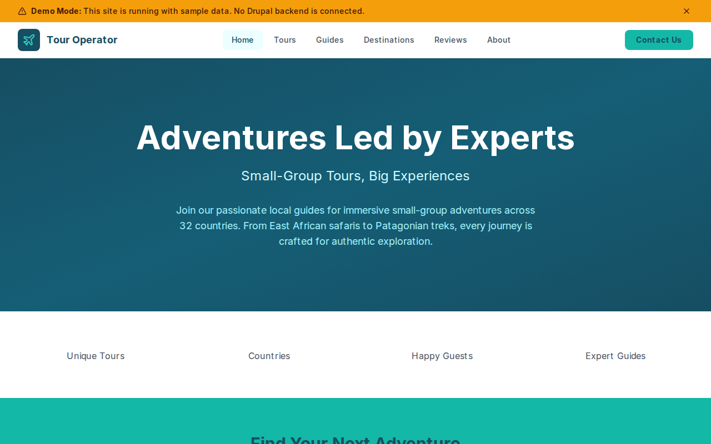

# Decoupled Tour Operator

A tour operator website starter template for Decoupled Drupal + Next.js. Built for adventure travel companies, tour operators, expedition outfitters, and guided travel businesses.



## Features

- **Tours** - Showcase guided tours with pricing, duration, difficulty, group size, highlights, and featured images
- **Guide Profiles** - Expert guide bios with specialties, languages, certifications, and years of experience
- **Destinations** - Operating destinations with regions, countries, best seasons, and descriptions
- **Reviews** - Guest testimonials with ratings, tour names, and travel dates
- **Static Pages** - About, FAQ, and other content pages
- **Modern Design** - Clean, accessible UI optimized for adventure travel content

## Quick Start

### 1. Clone the template

```bash
npx degit nextagencyio/decoupled-tour-operator my-tour-company
cd my-tour-company
npm install
```

### 2. Run interactive setup

```bash
npm run setup
```

This interactive script will:
- Authenticate with Decoupled.io (opens browser)
- Create a new Drupal space
- Wait for provisioning (~90 seconds)
- Configure your `.env.local` file
- Import sample content

### 3. Start development

```bash
npm run dev
```

Visit [http://localhost:3000](http://localhost:3000)

---

## Manual Setup

If you prefer to run each step manually:

<details>
<summary>Click to expand manual setup steps</summary>

### Authenticate with Decoupled.io

```bash
npx decoupled-cli@latest auth login
```

### Create a Drupal space

```bash
npx decoupled-cli@latest spaces create "My Tour Company"
```

Note the space ID returned. Wait ~90 seconds for provisioning.

### Configure environment

```bash
npx decoupled-cli@latest spaces env 1234 --write .env.local
```

### Import content

```bash
npm run setup-content
```

This imports:
- Homepage with hero, stats (85+ tours, 32 countries, 12,000+ guests, 40+ guides), and adventure CTA
- 4 tours: Serengeti Wildlife Safari ($4,500), Annapurna Circuit Trek ($2,200), Costa Rica Rainforest Adventure ($2,800), Iceland Northern Lights Photography ($3,100)
- 3 guides: Amani Kwame (Safari), Maya Sherpa (Mountain), Carlos Mendez (Rainforest)
- 3 destinations: Tanzania, Nepal, Costa Rica
- 3 reviews from safari, trek, and rainforest guests
- 2 static pages: About Trailmark Tours, FAQ

</details>

## Content Types

### Tour
- **tour_type**: Type taxonomy (Hiking, Cultural, Wildlife Safari, Kayaking, Photography, etc.)
- **duration**: Tour length (e.g., "7 Days", "14 Days")
- **price**: Price per person (e.g., "$4,500")
- **group_size**: Maximum group size (e.g., "Max 8 guests")
- **difficulty**: Physical difficulty level (Easy, Moderate, Challenging)
- **highlights**: Key tour highlights (list)
- **image**: Featured tour image
- **featured**: Whether the tour is featured on the homepage (boolean)

### Guide
- **specialty**: Area of expertise taxonomy (Mountaineering, Natural History, Marine Biology, etc.)
- **languages**: Languages spoken (list)
- **years_experience**: Years of guiding experience
- **certification**: Professional certifications (list)
- **image**: Guide profile photo

### Destination
- **region**: Geographic region taxonomy (East Africa, Himalayas, Central America, etc.)
- **country**: Country name
- **best_season**: Best time to visit
- **image**: Destination image

### Review
- **reviewer_name**: Name of the guest
- **tour_name**: Tour reviewed
- **rating**: Rating (1-5)
- **travel_date**: When the tour was taken
- **image**: Reviewer photo

### Homepage
- **hero_title**: Main headline (e.g., "Adventures Led by Experts")
- **hero_subtitle**: Tagline (e.g., "Small-Group Tours, Big Experiences")
- **hero_description**: Introductory paragraph
- **stats_items**: Key statistics (tours, countries, guests, guides)
- **featured_items_title**: Section heading for featured tours
- **cta_title / cta_description**: Adventure call-to-action block

### Basic Page
- General-purpose static content pages (About, FAQ, etc.)

## Customization

### Colors & Branding
Edit `tailwind.config.js` to customize colors, fonts, and spacing.

### Content Structure
Modify `data/tour-operator-content.json` to add or change content types and sample content.

### Components
React components are in `app/components/`. Update them to match your design needs.

## Demo Mode

Demo mode allows you to showcase the application without connecting to a Drupal backend.

### Enable Demo Mode

```bash
NEXT_PUBLIC_DEMO_MODE=true
```

### Removing Demo Mode

1. Delete `lib/demo-mode.ts`
2. Delete `data/mock/` directory
3. Delete `app/components/DemoModeBanner.tsx`
4. Remove `DemoModeBanner` from `app/layout.tsx`
5. Remove demo mode checks from `app/api/graphql/route.ts`

## Deployment

### Vercel (Recommended)
[](https://vercel.com/new/clone?repository-url=https://github.com/nextagencyio/decoupled-tour-operator)

### Other Platforms
Works with any Node.js hosting platform that supports Next.js.

## Documentation

- [Decoupled.io Docs](https://www.decoupled.io/docs)
- [Next.js Documentation](https://nextjs.org/docs)
- [Drupal GraphQL](https://www.decoupled.io/docs/graphql)

## License

MIT
